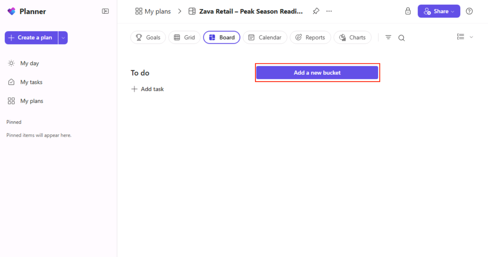
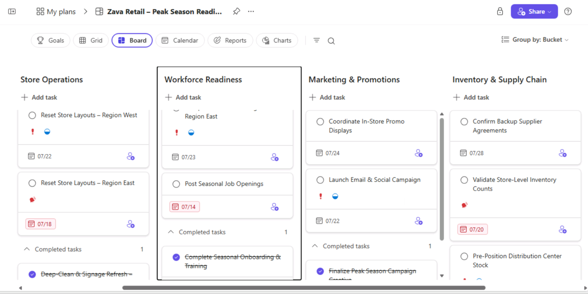
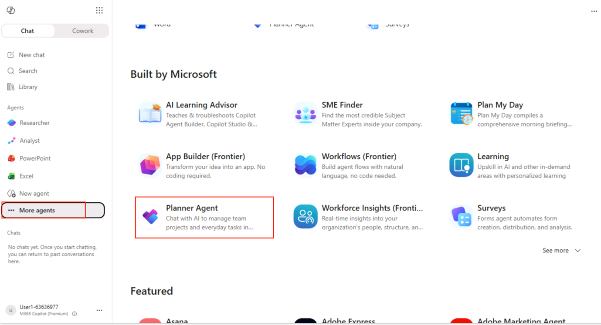
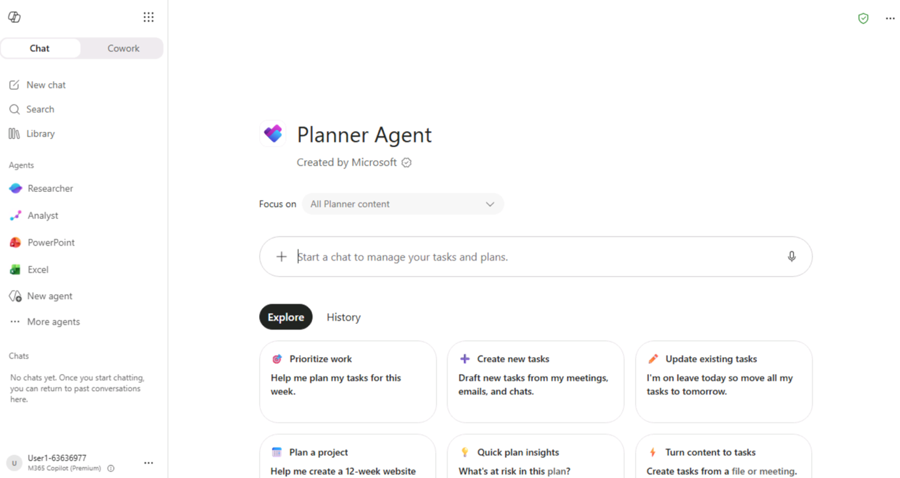
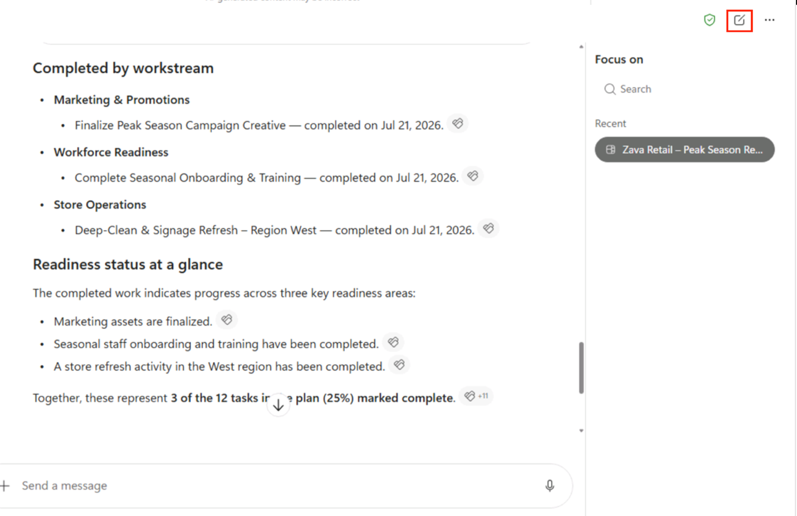
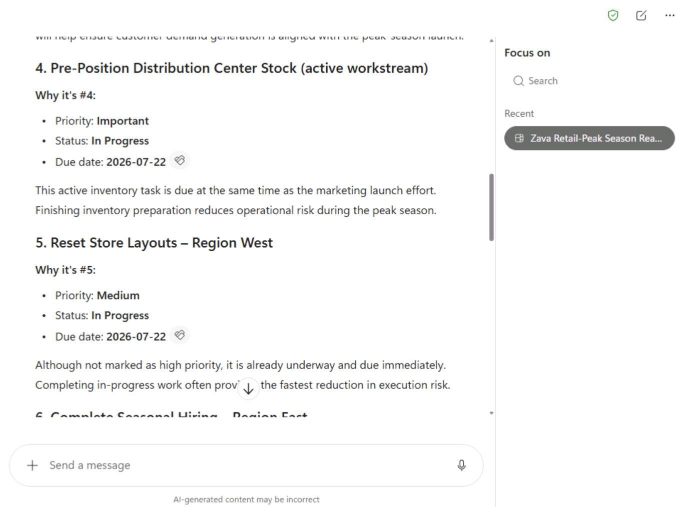
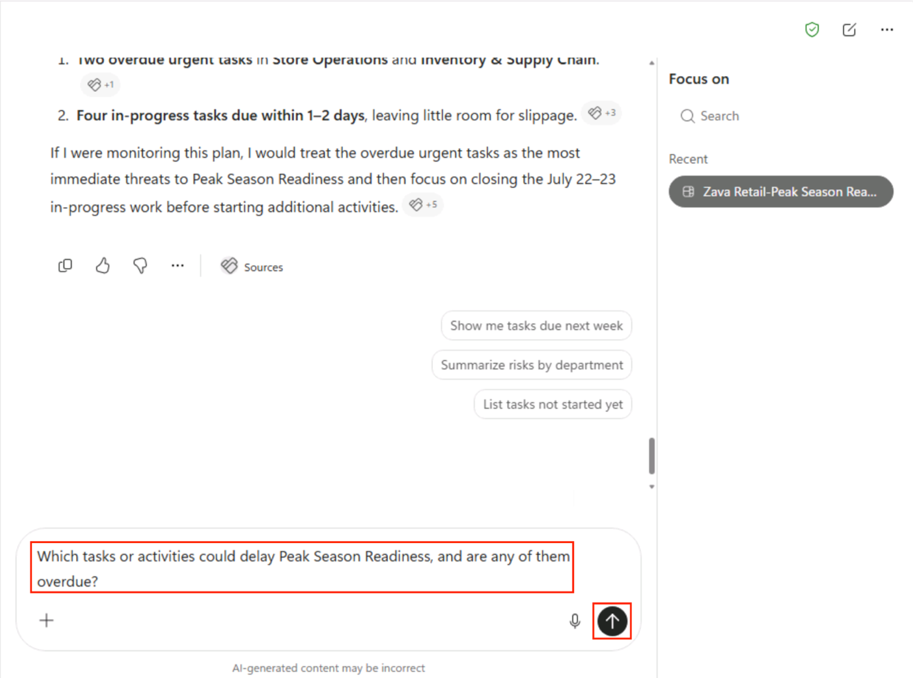
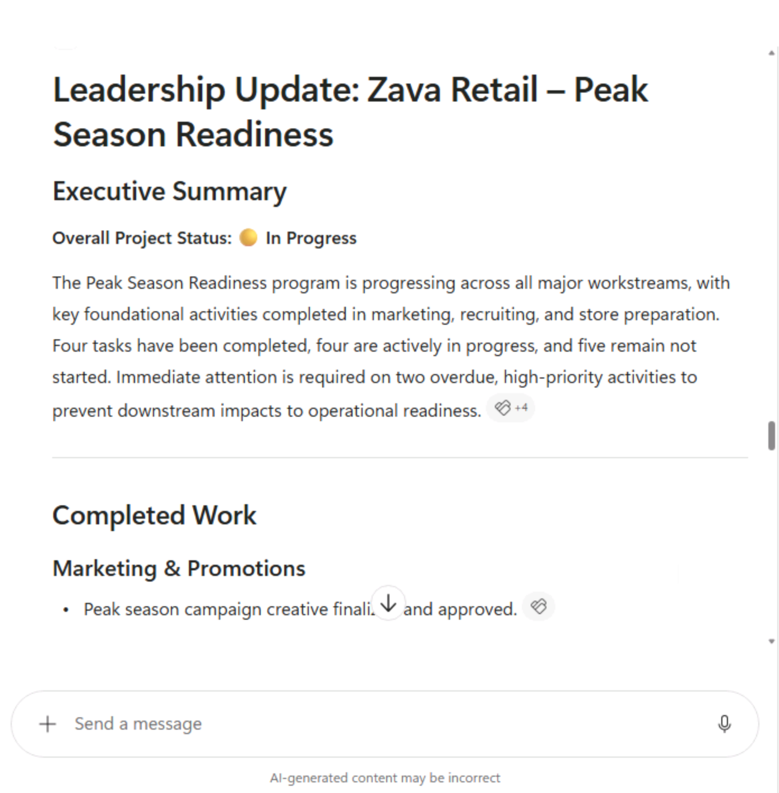

**Estimated Duration:** 40 minutes

**Lab Overview**

In this lab, you'll use Planner Agent in Microsoft 365 Copilot to review
project plans, identify risks, generate executive summaries, assign
follow-up work, and coordinate peak season readiness across multiple
teams.

**Scenario**

**Zava Retail** is a rapidly growing omnichannel retailer that serves
customers through its e-commerce platform and a network of more
than **50 retail stores**. As the business has expanded, so has the
complexity of coordinating store operations, inventory, marketing
campaigns, workforce readiness, and supplier activities across multiple
locations.

To prepare for the upcoming holiday shopping season, Zava Retail has
launched the **Peak Season Readiness Program**. The initiative brings
together Store Operations, Workforce Readiness, Marketing, and Inventory
teams to coordinate activities, track progress, and ensure every store
is ready before the busiest shopping period begins.

**Priya Nair**, the Regional Operations Manager, is responsible for
overseeing the program and ensuring every workstream stays on schedule.
Instead of manually reviewing hundreds of tasks across multiple buckets,
Priya uses **Microsoft 365 Copilot Planner Agent** to quickly assess
project health, identify overdue or high-priority work, summarize
progress, and recommend next steps.

In this lab, you'll step into Priya's role and use Planner Agent to
monitor the Peak Season Readiness Program, uncover potential risks, and
make informed operational decisions that help ensure every store is
ready for the busiest shopping season of the year.

**Key Personas**

1.  **Priya Nair - Regional Operations Manager**: Owns the Peak Season
    Readiness Program and coordinates activities across multiple
    departments. Uses Planner Agent to monitor project health, identify
    risks, and prepare executive updates.

2.  **Daniel Chen - Director of Store Operations**: Responsible for
    ensuring every retail location is operational before the holiday
    launch. Focuses on store readiness, staffing, and equipment
    deployment.

3.  **Sophia Martinez - Supply Chain Manager**: Monitors inventory
    availability, warehouse readiness, and supplier deliveries. Uses
    project updates to reduce stock shortages during peak demand.

4.  **Emma Brooks - Marketing Campaign Manager**: Coordinates
    promotional campaigns and store launch activities. Depends on timely
    completion of cross-functional tasks before marketing campaigns
    begin.

**Lab Objectives**

After completing this lab, you will be able to:

- Review Planner plans using Planner Agent.

- Identify overdue and high-risk tasks.

- Generate executive summaries.

- Recommend project priorities.

- Create and assign follow-up tasks.

- Track overall program readiness.

**Exercise 0: Lab Setup**

Creating plans in the planner

1.  Open a web browser and navigate to <https://teams.cloud.microsoft>

2.  Enter the following credentials to login to Teams:

    - Username
      - [*+++@lab.CloudPortalCredential*](mailto:+++@lab.CloudPortalCredential)(User1).Username+++

    - TAP Token
      - [*+++@lab.CloudPortalCredential*](mailto:+++@lab.CloudPortalCredential)(User1).AccessToken+++

> 
>
> 
>
> 

3.  From the left navigation menu, select 3 **dots(…)** and then
    select **Planner**.

> 

4.  Select **+Create a plan**.

> 

5.  Select **Create basic plan**.

> 

6.  Enter plan name as +++Zava Retail-Peak Season Readiness+++. Then
    select **Create basic plan**.

> 

7.  Select **Add to new bucket** to add a new bucket in the recently
    created plan.

> 

8.  Enter bucket name as +++**Store Operations+++** and press **Enter**.

> 
>
> Your new bucket is add.
>
> 

9.  Similarly, add the following buckets:

    - +++Workforce Readiness+++

    - +++Marketing & Promotions+++

    - +++Inventory & Supply Chain+++

10. Now we add the following new tasks in the Store Operations bucket:

[TABLE]

11. So select **+Add Task** and enter the task name from the above
    table. Then select **Add Task**.

12. 

13. After creating the task, select the task and then in the task window
    enter the given details.

14. 

15. 

16. Similarly, add the tasks in the following buckets:

17. Workforce Readiness:

[TABLE]

18. Marketing & Promotions:

[TABLE]

19. Inventory & Supply Chain

[TABLE]

20. So the final planner will look like this:

21. 

22. Now we are ready with the lab setup.

**Exercise 1 – Explore Planner Agent**

As the Regional Operations Manager, Priya Nair needs a quick overview of
the Peak Season Readiness Program before reviewing project progress.
Rather than navigating Planner manually, she'll begin by
accessing **Microsoft 365 Copilot Planner Agent**, which provides
AI-powered assistance for analyzing project plans, tracking tasks, and
identifying operational risks.

In this exercise, you'll access Planner Agent and become familiar with
its interface, preparing you to analyze the Peak Season Readiness
Program in the following exercises.

**Task 1 – Open Planner Agent**

Access Microsoft 365 Copilot from your Microsoft 365 environment. This
serves as the entry point for interacting with Planner Agent using
natural language.

1.  Open new tab and navigate to
    +++[*https://m365.cloud.microsoft/chat/+++*](https://m365.cloud.microsoft/chat/+++)

2.  Select **More agents**. Locate and select **Planner Agent** under
    Build by Microsoft.

> 

3.  Select **Open** to open Planner Agent.

> 

4.  Now Planner agent is ready to go.

> 

**Exercise 2 – Analyze the Peak Season Readiness Program**

With Planner Agent open, Priya has received a request from regional
leadership to provide a quick update on the Peak Season Readiness
Program. Rather than reviewing every task manually, she'll use Planner
Agent to understand the current state of the project, identify completed
work, and determine which activities are still in progress.

In this exercise, you'll use natural language prompts to generate an
AI-powered summary of the project and review its current execution
status.

**Task 1 – Summarize the Project**

Regional leadership has requested an overview of the readiness program
before the weekly planning meeting. Instead of manually reviewing every
task, you'll ask Planner Agent to generate a high-level summary of the
project.

1.  Enter the following prompt in the prompt filed and select Send
    button:

> +++Summarize the tasks in my Planner plan "Zava Retail – Peak Season
> Readiness"+++
>
> 

2.  Review the AI-generated summary.

> Notice how Planner Agent identifies:

- Completed work

- Tasks currently in progress

- Remaining work

- Overall readiness status

> 
>
> 
>
> 

**Task 2 – Review Current Activities**

After understanding the overall project status, Priya wants to know
which initiatives are actively being worked on. Use Planner Agent to
identify tasks currently in progress across the different operational
workstreams.

1.  Enter the following prompt and click Send button:

> +++Which tasks are currently in progress?+++
>
> 

2.  Review the response.

> 

**Task 3 – Review Completed Activities**

Before discussing remaining work, Priya also wants to recognize
milestones that have already been achieved. Use Planner Agent to
identify completed readiness activities across the program.

1.  Enter the following prompt and click the Send button:

> +++Which readiness activities have already been completed?+++
>
> 

2.  Review the completed tasks.

> 
>
> 

**Exercise 3 – Identify Priorities and Risks**

Although the project is progressing well, the holiday shopping season is
approaching quickly. Even a few delayed activities could impact store
readiness, inventory availability, or promotional campaigns. Before the
next operational review meeting, Priya must identify the
highest-priority work, understand potential schedule risks, and
determine whether the organization is on track for a successful launch.

**Task 1 – Identify Priorities**

With dozens of active tasks across multiple departments, it isn't always
obvious which activities deserve immediate attention. Ask Planner Agent
to identify the highest-priority work that should be completed this
week.

1.  Select **New Chat**.

> 

2.  Enter the following prompt and click the Send button:

3.  Analyze my Planner plan "Zava Retail – Peak Season Readiness" and

4.  recommend the top priorities for this week based on due dates,

5.  priorities, and task status.

> 

6.  Review Planner Agent's recommendations.

> 
>
> 
>
> 

**Task 2 – Identify Risks**

Priya now wants to understand which activities could delay the Peak
Season Readiness Program. Use Planner Agent to identify overdue tasks
and other potential risks that may affect the project timeline.

1.  Enter the following prompt and click the Send button:

> +++Which tasks or activities could delay Peak Season Readiness, and
> are any of them overdue?+++
>
> 

2.  Review the identified risks. Notice how Planner Agent surfaces the
    overdue, high-priority tasks — Deep-Clean & Signage Refresh – Region
    West and Validate Store-Level Inventory Counts — and explains why
    they pose a risk to the timeline.

> 
>
> 
>
> 

**Task 3 – Review Season Readiness**

After reviewing priorities and risks, Priya needs to determine whether
the organization is prepared for the upcoming holiday season. Ask
Planner Agent to evaluate the overall readiness of the business based on
the current project status.

1.  Enter the following prompt and click the Send button:

> +++Is the business ready for the start of peak season? Explain why or
> why not.+++
>
> 

2.  Review Planner Agent's assessment, including how it weighs the
    overdue tasks in its judgment.

> 
>
> 
>
> 
>
> 

**Exercise 4 – Generate Leadership Insights**

The regional leadership meeting begins in less than an hour, and Priya
needs a concise update on the Peak Season Readiness Program. Rather than
manually reviewing dozens of Planner tasks, she'll use Planner Agent to
summarize project progress, highlight operational risks, and identify
the actions needed to keep the program on schedule.

In this exercise, you'll use Planner Agent to generate leadership-ready
insights based on the current status of the Zava Retail – Peak Season
Readiness Planner plan.

**Task 1 – Summarize Project Status**

Before discussing operational decisions, leadership needs a quick
overview of the current state of the readiness program. Use Planner
Agent to summarize the Planner plan for executive stakeholders.

1.  Select **New Chat**.

> 

2.  Enter the following prompt and click the Send button:

3.  Review my Planner plan "Zava Retail – Peak Season Readiness" and

4.  summarize the current project status, including completed work,
    tasks in

5.  progress, remaining work, and any overdue activities.

> 

6.  Review the generated summary and verify that it accurately reflects
    the Planner plan by highlighting completed activities, ongoing work,
    remaining tasks, and overdue items. Notice how Planner Agent
    provides a concise project overview without requiring a manual
    review of every task.

> 
>
> 
>
> 

**Task 2 – Recommend Next Steps**

Leadership now wants to understand what actions should be taken to keep
the project on schedule. Ask Planner Agent to analyze the Planner plan
and recommend the next operational priorities.

1.  Enter the following prompt and click the Send button:

> +++Analyze my Planner tasks and recommend the next actions to keep the
> project on schedule.+++
>
> 

2.  Review Planner Agent's recommendations and verify that they focus on
    overdue tasks, high-priority activities, and upcoming deadlines.

> 
>
> 
>
> 
>
> 

**Task 3 – Prepare a Leadership Update**

To conclude the weekly readiness review, Priya needs a report she can
share with regional leadership. Use Planner Agent to generate a
comprehensive readiness update that includes project status,
accomplishments, risks, and recommended actions.

1.  Enter the following prompt and click the Send button:

2.  Based on my Planner plan "Zava Retail – Peak Season Readiness",
    prepare a leadership update that includes:

3.  • Overall project status

4.  • Completed work

5.  • Tasks currently in progress

6.  • Remaining work

7.  • Overdue or high-priority tasks

8.  • Recommended next steps

> 

9.  Review the generated leadership update and confirm that it
    summarizes the current state of the Planner plan in a clear,
    business-focused format suitable for sharing during an operational
    review meeting.

> 
>
> 
>
> 

**Summary**

In this lab, you used Microsoft 365 Copilot's Planner Agent to transform
cross-functional program execution at Zava Retail. You reviewed project
progress, analyzed assigned tasks, identified risks and overdue work,
generated executive-ready summaries, recommended next steps, and created
follow-up tasks to keep the Peak Season Readiness Program on track.
These capabilities demonstrate how Planner Agent helps improve
operational visibility, streamline collaboration across teams, and
enable more informed decision-making for business-critical initiatives.
