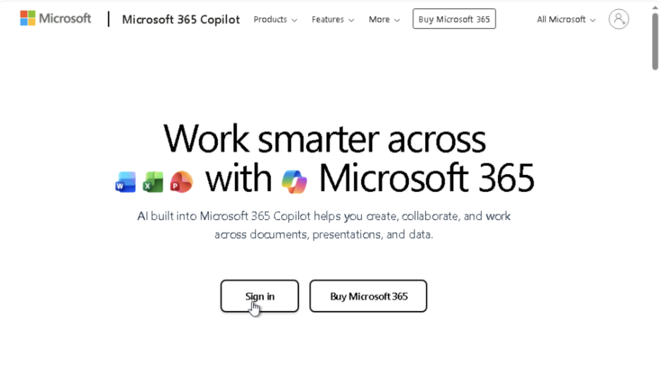
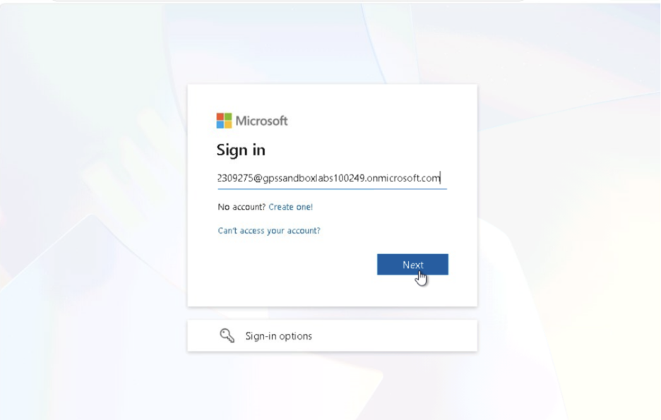
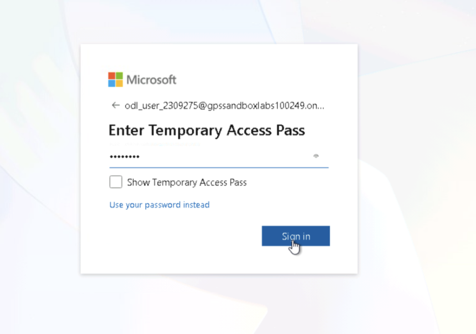
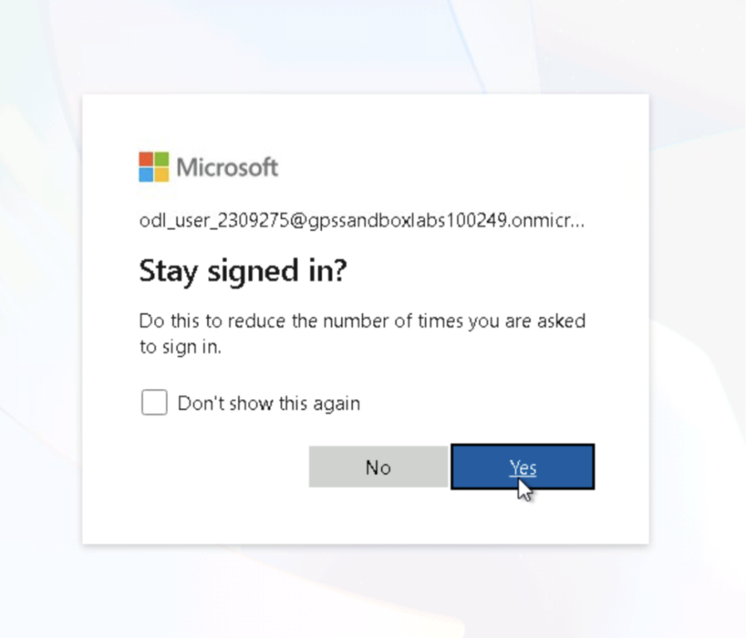

LAB 4 Executive meeting coordinator

|  |  |
|----|----|
| **Estimated time** | 20 minutes |
| **Objective** | Automate the full meeting lifecycle: AI-generated preparation, cross-app content collection, and post-meeting follow-up, all grounded in real M365 data. |
| **Skills & plugins** | Word (docx skill), Calendar Management, Scheduling, OneDrive / SharePoint connector, Microsoft Graph API, Teams connector, Transcript connector. |

**How to read this guide**

<table>
<colgroup>
<col style="width: 33%" />
<col style="width: 33%" />
<col style="width: 33%" />
</colgroup>
<tbody>
<tr>
<td>
<strong>PROMPT</strong>

Type or paste into Cowork.
</td>
<td>
<strong>FOLLOW-UP</strong>

A prompt sent in the same task.
</td>
<td>
<strong>CORRECTION</strong>

A prompt that fixes something.
</td>
</tr>
<tr>
<td>
<strong>NOTE</strong>

Useful context to know.
</td>
<td>
<strong>TIP</strong>

An optional shortcut or extra.
</td>
<td>
<strong>IMPORTANT</strong>

Do this to avoid an error.
</td>
</tr>
</tbody>
</table>

**Lab overview**

In this lab you act as an executive's assistant and use Cowork to run a
meeting end to end. You will build an AI-generated prep brief from live
Calendar, Email, OneDrive / SharePoint, and Teams data and save it to
OneDrive; refine that brief in place with a Risks section; collect every
artefact for a meeting into a single Meeting Pack folder with a
hyperlinked index; and attempt post-meeting follow-up from a transcript.
Along the way you'll see how Cowork asks for approval before writing to
storage, discloses failures instead of hiding them, and refuses to
fabricate content when no source material exists.

By the end of the lab you will be able to:

> •Prompt Cowork to gather data from multiple M365 sources in parallel
> and produce a Word deliverable.
>
> •Approve, scope, and troubleshoot Cowork actions using approval and
> disambiguation cards.
>
> • Refine an existing document in place rather than creating
> duplicates.
>
> •Organise related files, emails, and chats into a structured Meeting
> Pack with an index.
>
> •Recognise correct grounding behaviour when source material is
> missing.

**Prerequisites**

> • Access to the lab M365 tenant, signed in with your lab credentials.
>
> •Cowork is available and you are on the Cowork tab, not Chat.
>
> • These skills and plugins are active: Word (docx skill), Calendar
> Management, Scheduling, OneDrive / SharePoint connector, Microsoft
> Graph API, Teams connector, and Transcript connector.
>
> •Outlook Calendar contains the Project Planning Workshop and Project
> Sync meetings used in Exercises 1 and 2.
>
> •OneDrive is accessible so Cowork can create the Lab Files and Meeting
> Pack folders. Do not pre-create them, Exercise 1 tests folder
> creation.
>
> • Word Online is available for opening and verifying the generated
> documents.
>
> •Completion of Labs 1–3 is recommended but not required.

**Exercise 1: AI-generated meeting preparation**

**Goal:** Build a cross-app meeting prep brief as a Word document saved
to the OneDrive Lab Files folder, with data gathered from Calendar,
Email, OneDrive / SharePoint, and Teams in parallel.

- Open your browser and go to **m365.cloud.microsoft** (or your
  organisation's M365 entry point). Sign in with your lab account.

>  title="A screenshot of a computer
>
> AI-generated content may be incorrect."
> style="width:6.5in;height:3.84375in" />
>
>  title="A screenshot of a login box
>
> AI-generated content may be incorrect."
> style="width:6.5in;height:4.13542in" />
>
>  title="A screenshot of a login screen
>
> AI-generated content may be incorrect."
> style="width:6.5in;height:4.5625in" />

- Click Yes to stay signed in.

>  title="A screenshot of a computer screen
>
> AI-generated content may be incorrect."
> style="width:6.5in;height:5.5625in" />

**Step 1 — Send the preparation prompt**

1.  Go to the Cowork tab (not Chat).

*The Cowork tab, ready for a new task.*

2.  In the prompt bar, type the prompt below and press **Enter**:

<table>
<colgroup>
<col style="width: 100%" />
</colgroup>
<tbody>
<tr>
<td><strong>PROMPT · BUILD PREP BRIEF</strong></td>
</tr>
<tr>
<td>
Prepare me for my next meeting. Build a one-page prep brief
containing:

attendee list with my last interaction with each, the stated
purpose,

related email threads and files, open action items from previous
related

meetings, and 3 questions I should ask. Save it as a Word document in
my

'Lab Files' folder named 'Prep - June 19, 2026 - Project Planning
Workshop'.
</td>
</tr>
</tbody>
</table>

*Prompt submitted, Cowork begins processing.*

3.  Cowork auto-names the session and shows “Narrowing down the
    approach” before opening the Workspace panel.

*Workspace opens, Step 1 complete, calendar accessed.*

Cowork read Outlook Calendar and found “Project Planning Workshop today,
8:00 AM–12:00 PM UTC.” The plan is still expanding.

*The plan expands to five steps, parallel lookups begin.*

4.  Steps 2–4 (attendee profile, emails and files, transcripts) run in
    parallel; step 5 (document build) waits for all data.

*Data gathering complete, transitioning to the document build.*

5.  Cowork notes the “Lab Files” folder doesn't exist yet and will
    create it rather than fail.

**Step 2 — Approve folder creation**

1.  A **Create folder?** card appears. Click **Create** to approve.

<table>
<colgroup>
<col style="width: 100%" />
</colgroup>
<tbody>
<tr>
<td>
<strong>▲ IMPORTANT</strong>

Do NOT type in the message bar while an approval card is open, it
cancels the action.
</td>
</tr>
</tbody>
</table>

*Approval card: “Create folder?” for Lab Files in OneDrive.*

2.  Cowork requests approval before writing to OneDrive and confirms the
    exact folder name from your prompt. This approve-before-write
    pattern means Cowork never modifies storage silently.

3.  Click **Create** to proceed.

*Cursor on the Create button, about to approve.*

*Folder created, the Word plugin activates.*

4.  “Approved 1 action” confirms the Lab Files folder was created, and
    the Word plugin activates, required to generate the .docx.

**Step 3 — Watch the document build**

1.  Cowork now builds the Word document. No action is required, just
    observe the sequence.

*Word document build starts, the agent narrates its plan.*

2.  Cowork uses a two-phase approach: it writes a content plan, then
    executes it to produce the .docx.

*Folder confirmed, Word build in progress.*

*Four parallel sub-tasks enumerated.*

3.  Cowork lists four lookups (attendee, emails and files, transcripts,
    Teams chats) and confirms it is the meeting organiser.

*First parallel batch complete, deeper email search begins.*

4.  Three connectors ran simultaneously: Directory, Email + Files, and
    Outlook. Cowork now reads full email bodies.

*Deepest data layer, email bodies, Teams chats, and transcripts.*

5.  Four simultaneous calls run. Empty transcript results are expected
    in a sandbox.

*Build error detected and self-corrected, spacing optimised.*

6.  Cowork self-corrected a syntax error, then detected a two-page spill
    and began reducing spacing to meet the one-page requirement.

*Second round of spacing reduction, document close to one page.*

7.  Cowork targets the exact overflow elements (the alert box and
    questions table) for margin reduction.

*Final fixes, smart quotes, trailing spacer, upload preparation.*

8.  Three quality fixes: questions shortened, smart quotes converted to
    ASCII, and the trailing blank spacer removed. The file is then
    encoded for upload.

**Step 4 — Approve the upload and open the brief**

1.  A **Use Microsoft Graph?** card appears. Click **Approve** to upload
    the document to OneDrive.

<table>
<colgroup>
<col style="width: 100%" />
</colgroup>
<tbody>
<tr>
<td>
<strong>▲ IMPORTANT</strong>

Do NOT type in the message bar while the card is open.
</td>
</tr>
</tbody>
</table>

*Upload approval card: “Use Microsoft Graph?” to save to Lab Files.*

2.  Every file write to OneDrive requires this approval. “Always allow”
    pre-approves future Graph calls this session.

*Upload failed, document still accessible via the link card.*

3.  The upload failed due to sandbox permissions. The document is still
    reachable via the link card in the chat, Cowork reports the failure
    transparently rather than pretending it succeeded.

4.  Click the document link card to open the prep brief in Word Online
    and verify all sections.

*Word Online, the completed prep brief.*

5.  All five sections are populated with real M365 data: Meeting
    Details, Attendees, Emails, Files, and 3 Questions.

*Cowork shows the 3 questions and a heads-up alert.*

6.  The three questions are grounded in the meeting's stated purpose.
    The heads-up alert proactively flags an invite bounce, a risk Cowork
    surfaced from email data without being asked.

*The Word document's lower sections.*

7.  The Attendees table shows the last interaction, Related Emails shows
    the invitation and bounce notice, Related Files honestly reports “No
    related files found,” and the question table is present.

**Step 5 — Refine the brief in place (add a Risks section)**

1.  Send the refinement prompt below:

|  |
|----|
| **PROMPT · REFINE** |
| Add a Risks section listing anything in the email threads that sounds like a blocker. |

*Refinement prompt typed and ready to send.*

2.  This tests whether Cowork updates the existing document or creates a
    duplicate. No Risks section exists yet.

*Refinement submitted, Cowork re-analyses email threads.*

3.  Cowork reuses the threads already gathered, no new API calls needed.
    The document stays unchanged while the update is prepared.

*The document before the update.*

It ends with “3 Questions to Ask,” Page 1 of 1, a useful before/after
comparison point.

*Risks section added, grounded content confirmed.*

4.  The Risks / Blockers section is added with one grounded finding (the
    invite bounce). The document still fits on one page and was updated
    in place, not duplicated.

**Step 6 — Move the updated file to Lab Files**

1.  Send the prompt below:

|                                            |
|--------------------------------------------|
| **PROMPT · MOVE FILE**                     |
| move updated word file to lab files folder |

*Move prompt typed and sent.*

2.  Cowork must interpret “updated word file” as a specific OneDrive
    file ID, verify it contains the Risks section, then present an
    approval card.

*Cowork searches OneDrive to locate the correct version.*

3.  It gets the OneDrive root path and searches by filename, selecting
    the updated file over the original.

4.  **Use Microsoft Graph?** card appears for the move. Click
    **Approve**.

*File verified, “Use Microsoft Graph?” card for the move.*

5.  Cowork confirmed the file contains the Risks section before
    requesting the move.

*Move blocked twice, Cowork pivots to a copy operation.*

6.  The move API was blocked by sandbox restrictions. Cowork reports
    both failures and autonomously falls back to a copy, no user input
    needed.

*Copy succeeds, file verified in the Lab Files folder.*

7.  Cowork verifies the file appears in Lab Files by listing folder
    contents before confirming success.

*Housekeeping note about two copies.*

8.  Cowork discloses that a second copy remains in the working folder
    and honestly notes it cannot delete it from here.

*Document thumbnail, v2 file confirmed in the Output panel.*

9.  The Output panel shows two files: v2 (with Risks) and the original.
    Use the v2 link to open the final document.

10. Open **OneDrive \> My files** and verify the Lab Files folder exists
    with one item.

*OneDrive web view, Lab Files folder with one item.*

11. External verification that the Cowork workflow produced a real,
    accessible OneDrive folder.

*Two-file status table, v2 is correct, original is outdated.*

12. Cowork provides a clear status table: v2 (with Risks) is the correct
    file; the original is outdated. Click the v2 link.

*Word Online, the Risks / Blockers section in the final document.*

13. The Risks / Blockers section shows Blocker, Source (the actual email
    subject), and Recommended Action. Page 1 of 1, the one-page
    constraint is maintained. Exercise 1 complete.

**Exercise 2: Collect documents, emails, and action items**

**Goal:** Gather all content related to the Project Sync meeting and
organise it into a Meeting Pack folder in OneDrive with a hyperlinked
index document.

**Step 1 — Send the collection prompt**

1.  Send the prompt below:

<table>
<colgroup>
<col style="width: 100%" />
</colgroup>
<tbody>
<tr>
<td><strong>PROMPT · BUILD MEETING PACK</strong></td>
</tr>
<tr>
<td>
For the Project Sync meeting, gather everything related: files
in

OneDrive/SharePoint, email threads, Teams messages, and any open
tasks.

Organise them into a single 'Meeting Pack' folder in OneDrive and
give me

an index document linking to each item with a one-line
description.
</td>
</tr>
</tbody>
</table>

*Exercise 2 prompt typed and ready to send.*

2.  This gathers content from four M365 sources and produces a
    hyperlinked index. The two Exercise 1 output files carry over in the
    Workspace panel.

*A new four-step Workspace plan, parallel search launched.*

3.  Cowork searches Outlook for the Project Sync event and Files +
    Email + Teams for related content. Graph API permissions from
    Exercise 1 carry over.

*Project Sync identified, false positives detected, deeper search
initiated.*

4.  Project Sync is found (June 23, 9:00–9:45 AM UTC). The initial
    search returned loose keyword matches, so Cowork flags the quality
    issue and deepens the search rather than filling the pack with
    irrelevant results.

**Step 2 — Scope the pack**

1.  A **Pack scope** card appears. Select option 1, **Project planning
    work**.

*Scope disambiguation card, three options for pack content.*

2.  “Project Sync” is too generic, Cowork found two content clusters and
    presents options rather than guessing. It also reports that open
    tasks couldn't be retrieved due to a permission gap.

- Confirm option 1 is selected (filled badge), then click **Submit**.

*Option 1 selected: “Project planning work” scoped.*

3.  The pack will include the prep doc with Risks, the invitation and
    bounce emails, and the Teams chat. Active sales-deal threads are
    correctly excluded as unrelated.

**Step 3 — Approve the folder and build the index**

1.  A **Create folder?** card appears. Click **Create** to approve the
    Meeting Pack folder.

*“Create folder?” card for Meeting Pack – Project Sync.*

2.  Same folder-creation pattern as Exercise 1. Both Graph API
    permissions from Exercise 1 remain active.

*Meeting Pack folder created, prep brief being copied in.*

Cowork correctly selects the v2 prep brief (with Risks) to copy in,
demonstrating cross-exercise memory.

*Step 3 complete, index-document creation starts.*

3.  Cowork waits for OneDrive sync confirmation before generating
    hyperlinks, so all links point to verified locations.

*All four steps complete, a 5-item index confirmed with caveats.*

4.  The index links to five items with honest caveats (task-permission
    gap, scope limit). Cowork also flags two action items: the bounced
    invite and missing Project Sync attendees.

**Step 4 — Verify the index document**

1.  Click the Meeting Pack index link to open it in Word Online. Verify
    the first three rows and test the hyperlinks.

*Word Online, the Meeting Pack index, first three items.*

The header shows “Meeting Pack – Index” with meeting details. Items 1–3
(calendar event, prep brief, invitation email) have hyperlinks and
source-type labels.

*Word Online, the complete index with all five items and Notes &
Coverage.*

2.  All five items have hyperlinks, source labels, and one-line
    descriptions. The Notes & Coverage section documents the
    task-permission gap, the scope limit, and the bounced-invite action.
    Page 1 of 1. Exercise 2 complete.

**Exercise 3: Post-meeting follow-up automation**

**Goal:** Generate a meeting summary, action items, follow-up email, and
tasks from a transcript. This demonstrates AI grounding, refusing to
fabricate content when no source material exists.

**Step 1 — Send the follow-up prompt**

1.  Send the prompt below:

<table>
<colgroup>
<col style="width: 100%" />
</colgroup>
<tbody>
<tr>
<td><strong>PROMPT · POST-MEETING FOLLOW-UP</strong></td>
</tr>
<tr>
<td>
From this meeting's transcript/notes: (1) write a crisp summary
with

decisions made, (2) extract action items with owner and due date, (3)
draft

a follow-up email to all attendees, and (4) create tasks for the
items

assigned to me. Show me everything for review before creating or
sending

anything.
</td>
</tr>
</tbody>
</table>

*Exercise 3 prompt typed and ready to send.*

2.  The “Show me everything for review” safeguard tests whether Cowork
    defers all actions pending approval. Cowork will first search for a
    transcript.

*Grounding enforced: “I won't invent meeting content.”*

3.  Cowork enforces grounding immediately: before writing anything it
    needs the actual transcript or notes. It searches for transcripts,
    finds none, then widens the search to notes files.

*Complete refusal with three constructive forward paths.*

4.  After an exhaustive search, Cowork confirms no source material
    exists and declines to fabricate. It offers three alternatives:
    paste notes into chat, re-run after the meeting with transcription
    on, or point to a different meeting that has a transcript.

**Step 2 — Test in-loop correction**

1.  Send a correction to see how Cowork handles it when no output exists
    yet:

|                                                           |
|-----------------------------------------------------------|
| **PROMPT · CORRECTION**                                   |
| Actually, the website task was assigned to Priya, not me. |

*Correction pre-registered, honest state disclosure.*

2.  Cowork acknowledges the correction and honestly discloses that no
    action items have been generated yet, so there is nothing to
    correct. The correction is pre-registered for when notes are
    provided. Exercise 3 complete.

**Validation checklist**

Confirm every item against your actual Cowork session.

> ☐ Exercise 1 — A prep brief exists as a Word file in the OneDrive Lab
> Files folder, combining calendar, email, and file context. The Risks /
> Blockers section is present and grounded in a real email thread.
>
> ☐ Exercise 1 — The document was updated, not duplicated, when the
> Risks section was added. Only one new section was inserted.
>
> ☐ Exercise 2 — A Meeting Pack folder with a working index exists in
> OneDrive. The index links to five items with source labels and
> one-line descriptions.
>
> ☐ Exercise 2 — The Notes & Coverage section honestly documents what
> was omitted and why (task-permission gap, scope limit).
>
> ☐Exercise 3 — Cowork refused to fabricate meeting content and stated
> it would not invent decisions. Three constructive alternatives were
> offered.
>
> ☐ Exercise 3 — The action-item correction was acknowledged and
> pre-registered, without creating phantom corrected outputs.
